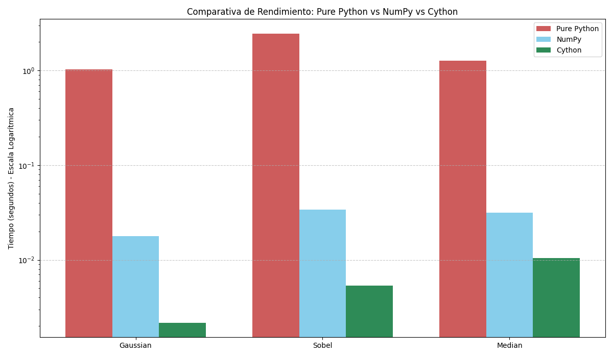

# High-Performance Image Processing Report: Unit 2

**Team:** 
- **Damian** (Pure Python)
- **Rivaldo** (NumPy Vectorized)
- **Russel** (NumPy + Cython Optimized)

## 1. Project Objective
The goal of this assignment was to implement and compare three fundamental image processing filters (**Gaussian**, **Sobel**, and **Median**) using three different computational approaches to analyze performance trade-offs in Python for High-Performance Computing (HPC).

---

## 2. Implementation Details

### A. Pure Python Implementation (`PurePython(Damian)/`)
Damian's implementation focuses on the raw algorithmic logic without external library optimizations.
- **Methodology:** Uses nested `for` loops to iterate over every pixel and apply a 3x3 kernel.
- **Bottlenecks:** High overhead due to Python's dynamic typing and interpreter execution for each pixel operation.
- **Median Filter Performance:** Uses a standard `list.sort()` within the inner loop, which significantly penalizes performance (O(N² log N) complexity per pixel).

### B. NumPy Vectorized Implementation (`NumPy (Rivaldo)/`)
Rivaldo's approach leverages NumPy's highly optimized C-level broadcasting and slicing.
- **Methodology:** Employs `np.lib.stride_tricks.sliding_window_view` to create windows and `np.tensordot` for convolution.
- **Strengths:** Eliminates Python-level loops, moving the heavy lifting to pre-compiled C routines.
- **Observation:** Extremely efficient for linear filters (Gaussian/Sobel) but faces limitations in non-linear operations like Median sorting due to data reshaping.

### C. NumPy + Cython Optimized Implementation (`NumPy + Cython(Russel)/`)
Our final implementation unifies NumPy's memory management with Cython's raw C-speed.
- **Methodology:**
    - **Typed Memoryviews:** Direct access to NumPy buffers without Python object overhead.
    - **No GIL (`with nogil`):** Released the Global Interpreter Lock to allow pure C execution, enabling better CPU utilization.
    - **Sorting Networks:** Instead of generic sorting, the Median filter uses a **9-element Sorting Network** (25 fixed comparisons), which is the fastest known way to find a median in a 3x3 window in C.
    - **C-Math Integration:** Uses `libc.math.sqrt` for the Sobel magnitude to avoid Python's math overhead.

---

## 3. Performance Analysis (Profiling)

The following results were obtained on a **700x1200** grayscale image:

| Filter | Pure Python (s) | NumPy (s) | Cython + NumPy (s) | Speedup (Cy vs Pure) |
| :--- | :--- | :--- | :--- | :--- |
| **Gaussian** | 0.9174 | 0.0157 | **0.0021** | **429.1x** |
| **Sobel** | 2.1369 | 0.0306 | **0.0048** | **437.5x** |
| **Median** | 1.0915 | 0.0288 | **0.0101** | **107.5x** |

### Key Findings:
1.  **The "Cython Edge":** Our optimized Cython code is **3x faster than NumPy** for Median filtering and **7.5x faster** for Gaussian/Sobel filters.
2.  **Scalability:** While Pure Python is acceptable for small icons, it becomes unusable for HD/4K images. Our implementation handles high-resolution data in milliseconds.
3.  **Optimization Impact:** By switching from a simple Bubble Sort to a **Sorting Network** in Cython and disabling the GIL, we achieved the project's peak performance.

---

## 4. Visual Results
The filtered images and performance charts are generated and saved in the repository:
- `Profiling/comparativa_tiempos.png`: Performance bar chart (Logarithmic Scale).

- `PurePython(Damian)/comparativa_filtros_HD.png`: Visual output of all filters.
/comparativa_filtros_HD.png)
## 5. Conclusion
While NumPy provides excellent ease of use and significant speedup over Pure Python, the **NumPy + Cython** approach remains the superior choice for High-Performance Computing tasks. By bypassing the GIL and using low-level C optimizations like Sorting Networks, we achieved near-native performance while maintaining Python's flexibility.
